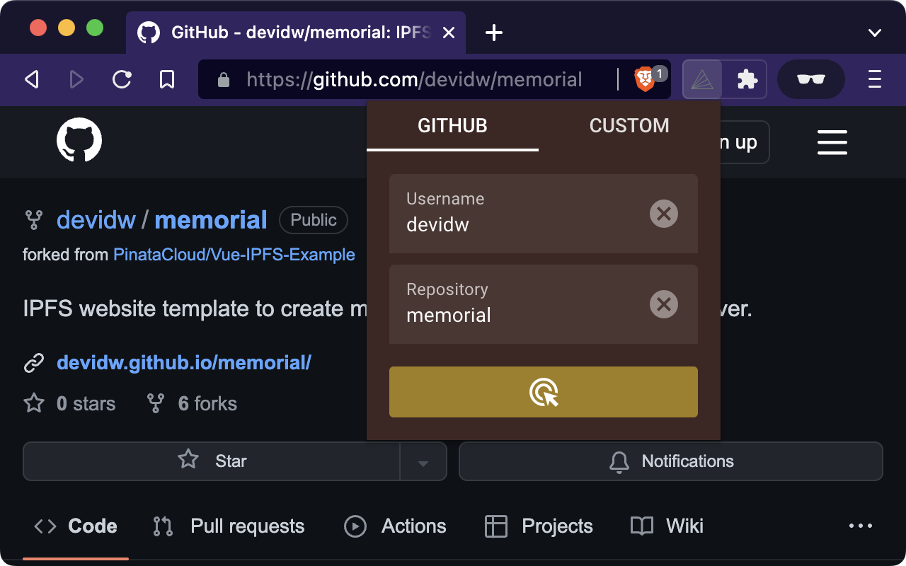
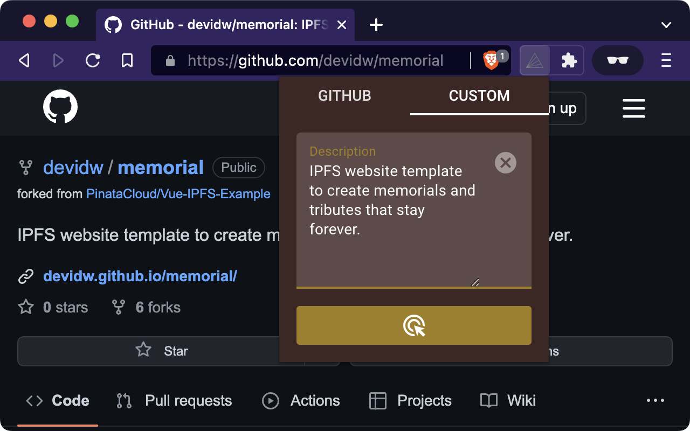
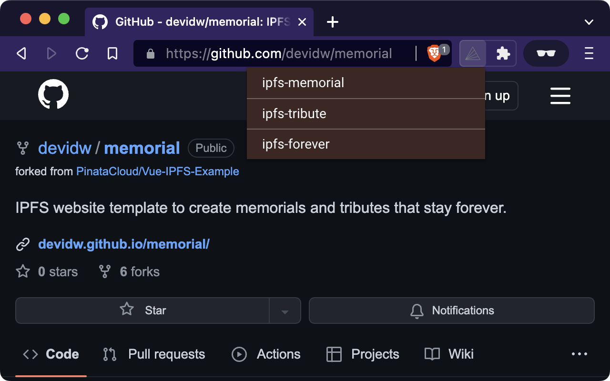

= GitHub Repository Naming Suggestion Service

Let AI suggest namings for your GitHub repositories. Open any public repo on GitHub, and use the extension as a client to prompt OpenAI for naming suggestions using the GitHub repository's description and your OpenAI API key.

== About

Ever wondered how to name your GitHub repository?

Often we have a very good understanding of what our code does, but we don't know how to put all of that into a single repository name.

That's where _GHRNS_ (GitHub Repository Naming Suggestion Service) comes into play: It automatically suggests meaningful names for your repository based on your repository description.

Suggestions are generated by artificial intelligence from https://openai.com/[OpenAI].

The browser extension automatically detects the current repository you are looking at on GitHub, then you can generate suggestions from the web browser extensions pop-up.

The extension requires credentials for the OpenAI API. Once you have your API key, you can set it up in the extension options and start generating suggestions.

== Installation
. Get your copy of the extension from the Chrome Web Store
. Once the installation is complete, you can enter your OpenAI API key in the extension options (right-click the extension icon and select "Options")

== Usage
Once you have finished installing the extension, you can use it to generate suggestions for your GitHub repositories by clicking the extension icon in the browser toolbar.

[cols="2"]
|===
| 
a|
If you are viewing a public repository on GitHub, the extension will automatically detect it and prefills the current repository name as well as the current username in the pop-up (this info is used to query the public GitHub API to get the repo description, which is used to build your individual prompt).

In case you are not actively viewing the repository you want to have suggestions for, you can manually enter the repository name and username in the pop-up as well.

| 
a|
Beside this GitHub flow, you can also use the extension to generate suggestions for a custom repo description. To do so, simply enter the description under the pop-up's "Custom" tab.

| 
a|
Once you have all your details filled in, you can click the button below the form elements to get your suggestions.

After requesting your suggestions, you will see a loading indicator for a few seconds, during this period add data needed is fetched, prepared and suggestions are generated.

When the suggestions are ready, you will see them in the pop-up formatted as a list.

Note that you can hover over each suggestion and click it to copy it to your clipboard.

If the repo name you are generating suggestions for is included in the suggestions by the AI, it will be highlighted in the list, in this case the existing repo name is probably a good choice.
|===

== OpenAI App Review
This project falls under the _Open-source / BYOK (Bring-Your-Own-Key)_ application domain, itself is not high-stakes or disallowed, uses the end-user's API key, keeps this key at the client side and therefore https://web.archive.org/web/20220630053421/https://beta.openai.com/docs/usage-guidelines/app-review[doesn't require an OpenAI app review].

== Privacy practices

=== Single purpose
Its purpose is to generate meaningful repository names for your GitHub repositories. It acts as a helper tool for developers to name their repositories faster and easier.

=== Permission justification

==== `storage` justification
Storage is needed to save the API credentials.

==== `tabs` justification
Access to the browser tabs is needed to detect the current repository. See if the current tab is a GitHub repository, and if so, get the repository name as well as the username, to get the repo description, which then is used to generate the suggestions.

// ==== `activeTab` justification

// ==== Host permission justification

==== Remote code justification
Remote code is needed to generate suggestions, since the corresponding API is not part of the extension, it invokes server-side code of a third party service: OpenAI.
